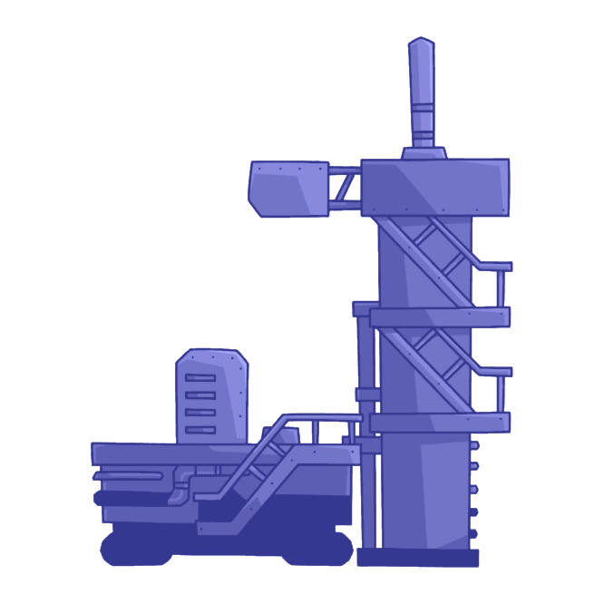

# [NFT Launchpad](https://gentle-capybara-ad7963.netlify.app/)

  

 

  

 

## 💬 **About the project**

NFT Launchpad connects digital artists with their audience by providing a standard primary NFT market with both presale and non-presale options that fairly/randomly distribute collection NFTs among the buyers

> **FullStack Repo**, This repo includes both frontEnd and smart contracts files all together. It has a project structure facilitating a fast/clean integration and collaboration between backEnd and frontEnd team.

## ⚔️ **ChainLink Tools used**
* ChainLink Data Feeds 💸
* ChainLink VRF 🎲

 

## 🚀 **Onboarding**

You will need a Windows, Mac or Linux computer with command line access and permission to install new system packages. An active Internet connection is required to install the following required software:

- Node https://nodejs.org/en/
- NPM https://www.npmjs.com/
- Yarn https://yarnpkg.com/

To initialize the project, using the terminal, navigate to the folder containing the project and run the `yarn install` command. This will install all the necessary packages and prepare your project for local development. Then you can use `yarn dev`
 

## 📄 **Smart Contracts Inventory**

| Contract          | Network | Testnet Address                            |
| :--------------------- | :------ | :----------------------------------------- |
| CollectionFactory            | Polygon | [0xf8A68b2EeaA3588b7AeEAA62A0C2F9f57EE8EdB3][mumbai-url-factory] | 
| NFTStore            | Polygon    | [0x8Fd25199a0D51B94948Be95d8Abb2E02FE1EDfaE][mumbai-url-factory] | 

 

## 📓 **Additional Notes**

**Commit Standard**. The project aims to standardize commits as much as possible, therefore we invite you to use the [Conventional Commits](https://www.conventionalcommits.org/en/v1.0.0/) specification.

**NatSpec Standard**. Solidity Smart Contracts are documented following [NatSpec Format](https://docs.soliditylang.org/en/develop/natspec-format.html).
 

We have used the following frameworks:

* Hardhat
* Solidity
* vue.js

 

## 💻 **Browser Support**

Currently, we aim to support the latest two versions of the following browsers:

    

[mumbai-url-factory]: https://mumbai.polygonscan.com/address/0xf8A68b2EeaA3588b7AeEAA62A0C2F9f57EE8EdB3#code
[mumbai-url-store]: https://mumbai.polygonscan.com/address/0x8Fd25199a0D51B94948Be95d8Abb2E02FE1EDfaE#code
